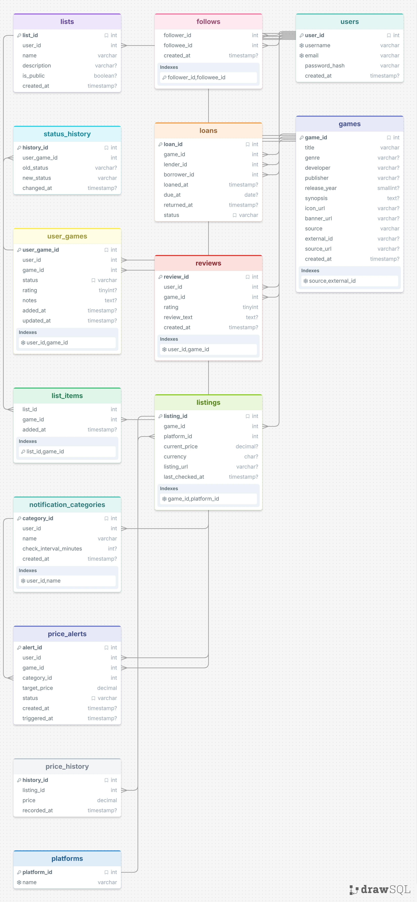

#  GameBuddy | CS 514 Final Team Project
Design Planning: https://docs.google.com/document/d/1SZhi5rWudaYoxWQ4refjZ3xmhEVcpnUgkQmJFg961Mw/edit?usp=sharing

Website Link: https://sites.google.com/view/gamebuddyfs

## What it is
A multi-user game wishlist manager and price tracker. Sites like gg.deals
track prices across major platforms but treat every wishlist item the same
way, bombarding you with notifications regardless of how much you actually
care about a given game and they don't cover niche platforms (VR, retro,
mods, mobile). This app lets you build a wishlist across any platform, see
current and historical prices, and organize games into your own notification
categories (e.g. "hunting hard" checked hourly, vs. "someday maybe" checked
weekly) so you only get pinged about what you actually care about.

## Team
- David Nguyen - Team lead, floats across database, backend, and testing/benchmarking
- Eugene Vinnichenko - Backend & database
- Elmer Mendez - Backend Support and Presenting & Website
- Brandon Tse - Frontend Support and Testing/benchmarking
- Harish Raaj Sivakumar - Frontend 

## Tech stack
- MySQL
- Python (data import / price-check scripts)

## Project structure
- `schema.sql` — database schema: games, per-user wishlist tracking, custom
  notification categories with their own check schedules, price history, and
  two stored procedures (lending a physical copy, and recording a price
  check/triggering alerts) demonstrating transactions
- `import_steam.py` — pulls game details + current pricing from Steam's
  store API and logs it through the database

## Setup (so far..)
1. Run `schema.sql` in MySQL Workbench (open the file, run the whole
   script) to create the `game_tracker` database and all its tables.
2. `pip install requests mysql-connector-python python-dotenv`
3. Copy `.env.example` to `.env` and fill in your own MySQL password.
4. `python import_steam.py` to pull sample game + pricing data in from
   Steam.

## Status
Phase 1 - schema built and tested, Steam import pipeline working
end-to-end (games, prices, and price history confirmed populating
correctly). Draft website content in progress.

## ER Diagram

